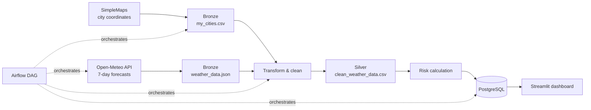

# Weather Logistics Pipeline

<div align="center">

### Weather intelligence for safer delivery planning

An end-to-end data platform that collects Moroccan city data and weather forecasts, transforms them into logistics risk indicators, stores them in PostgreSQL, and exposes them through an interactive Streamlit dashboard.


</div>

---

## Overview

Weather conditions can directly affect delivery reliability. This project turns forecast data into a practical risk signal for logistics teams:

- **Collect** city coordinates and seven-day forecasts.
- **Transform** raw responses into an analysis-ready Silver dataset.
- **Score** each forecast with a weather risk score and level.
- **Load** curated data into PostgreSQL.
- **Explore** alerts, trends, and high-risk locations in Streamlit.

## Data flow



## What the dashboard shows

| View | Purpose |
| --- | --- |
| High-risk alerts | Identify forecasts marked `HIGH` |
| Temperature leaders | Find cities with the highest forecast temperatures |
| Precipitation leaders | Surface cities with the strongest precipitation signals |
| Risk score periods | Compare weekly risk concentration |
| City trends | Follow temperature, precipitation, and wind evolution |
| Risk map | Locate forecast risk geographically |

## Quick start

### Requirements

- Docker and Docker Compose
- Git
- At least 4 GB of available memory for the containers

### 1. Clone the project

```bash
git clone <repository-url>
cd weather_logistics_pipeline
```

### 2. Create the environment file

Create a `.env` file in the project root:

```env
POSTGRES_USER=postgres
POSTGRES_PASSWORD=postgres
POSTGRES_DB=weather_db
AIRFLOW_ADMIN_USER=admin
AIRFLOW_ADMIN_PASSWORD=admin
PGADMIN_DEFAULT_EMAIL=admin@example.com
PGADMIN_DEFAULT_PASSWORD=admin
```

Keep `.env` local and never commit real credentials.

### 3. Start the platform

```bash
docker compose up -d
```

The first startup installs Python dependencies inside the Airflow and Streamlit containers. It can take a few minutes.

### 4. Open the services

| Service | URL | Use |
| --- | --- | --- |
| Streamlit | [localhost:8501](http://localhost:8501) | Weather risk dashboard |
| Airflow | [localhost:8080](http://localhost:8080) | DAG scheduling and monitoring |
| pgAdmin | [localhost:5065](http://localhost:5065) | PostgreSQL administration |
| PostgreSQL | `localhost:5432` | Database connection |

### 5. Run the pipeline

Open Airflow at [localhost:8080](http://localhost:8080), sign in with the credentials from `.env`, and trigger `weather_pipeline_dag`.

The pipeline writes the following datasets:

```text
data/bronze/my_cities.csv
data/bronze/weather_data.json
data/silver/clean_weather_data.csv
```

## Risk model

The pipeline combines precipitation, wind, precipitation probability, and temperature signals into a score from 0 to 100:

| Level | Score | Meaning |
| --- | ---: | --- |
| `LOW` | `< 30` | Normal operating conditions |
| `MEDIUM` | `30 - 59.9` | Conditions require attention |
| `HIGH` | `>= 60` | Potential delivery disruption |

## Project structure

```text
.
├── conception/              # UML diagrams
├── dags/                    # Airflow orchestration
├── dashboard/               # Streamlit application
├── data/
│   ├── bronze/              # Raw inputs and API responses
│   └── silver/              # Cleaned analytical data
├── extraction/              # City and weather extraction
├── load/                    # Risk calculation and PostgreSQL loading
├── schema/                  # Database initialization SQL
├── system_design/           # System architecture diagram
├── transformation/          # Cleaning and shaping logic
├── docker-compose.yml       # Local platform services
└── requirements.txt         # Python dependencies
```

## Useful commands

```bash
# Follow all service logs
docker compose logs -f

# Follow one service
docker compose logs -f streamlit

# Check running containers
docker compose ps

# Stop the platform
docker compose down

# Stop and remove persisted database volumes
docker compose down -v
```

## Local Python execution

For development outside Docker:

```bash
python -m venv .venv
source .venv/bin/activate
pip install -r requirements.txt

python extraction/extract.py
python transformation/transform.py
python load/load.py
streamlit run dashboard/app.py
```

The local commands require a reachable PostgreSQL instance and matching database environment variables.

## Design documentation

- [Class diagram](conception/classdiagram.puml)
- [Use case diagram](conception/usecase.puml)
- [System design](system_design/weather_logistics_pipline.excalidraw)
- [GitHub Project tickets](PLANIFICATION_GITHUB_PROJECT.md)

## Current scope

This repository is an MVP focused on the Moroccan forecast workflow. The Airflow DAG currently executes the complete ETL flow as one Python task; task-level orchestration, automated tests, and production secret management are part of the project backlog.

## License

This project is provided for educational and demonstration purposes.